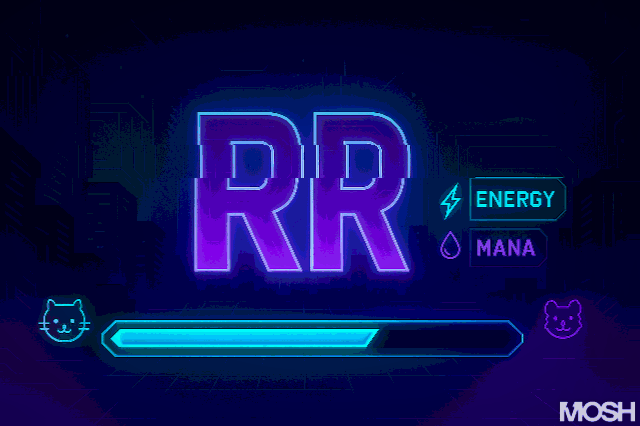

<p align="center">
  
</p>

### 🧙‍♂️ PLAYER PROFILE


🧑‍💻 Class: Full-Stack Dev  
🧠 Specialties: React Native, AI Tools, UI/UX  
⚡️ Alignment: Creative Coder + Visual Builder

---

```text
  _____  _     _ _______ _______ _______ _______
 |   __| |     | |______ |______    |    |______
 |____\| |_____| |______ ______|    |    ______|
```

### 🎯 ACTIVE QUESTS

- 🎮 Building mobile apps with deep UI polish  
- 🌐 Scaling modern web platforms  
- ⚙️ Tinkering with React Native animations + Reanimated 3  
- 🧱 Studying clean system design for large apps

---

```text
 _____ __   _ _    _ _______ __   _ _______  _____   ______ __   __
   |   | \  |  \  /  |______ | \  |    |    |     | |_____/   \_/  
 __|__ |  \_|   \/   |______ |  \_|    |    |_____| |    \_    |   
```

### 🛠️ INVENTORY (Tech Stack)

**Languages**  
  


**Frontend**  
  


**Mobile Dev**  


**Backend**  
  


**Tools**  


---

```text
 _______  _____  __   _ _______ _______ _______ _______
 |       |     | | \  |    |    |_____| |          |   
 |_____  |_____| |  \_|    |    |     | |_____     |   
```

### 📬 CONTACT THE PLAYER

- 🌐 [LinkedIn](https://www.linkedin.com/in/rehan-bandara-582088346)  
- 📧 [rrbandara505@gmail.com](mailto:rrbandara505@gmail.com)  
- 😎 Fun Fact: I mix game logic and design flow into *real apps people actually enjoy using*.

---

> 🧠 *“Code like it’s a speedrun. Design like it’s a boss fight.”*

---

